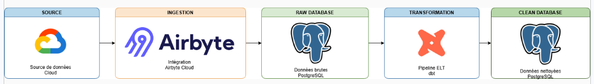
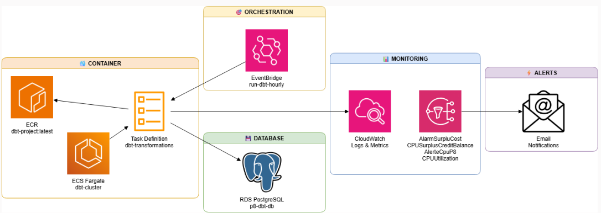

## Context

Ce projet a été réalisé dans le cadre de mon parcours de formation 'Data Engineer' avec OpenClassrooms.

Titre du projet :

`Construisez et testez une infrastructure de données`

Plateforme de données cloud dédiée à l'intégration de données météorologiques multi-sources. Le projet s'appuie sur Airbyte pour l'ingestion automatisée vers PostgreSQL sur AWS et sur dbt pour la transformation, la modélisation et le contrôle qualité des données. L'architecture garantit des flux automatisés, traçables et fiables pour les besoins analytiques et de machine learning.

# Flux de données

# Architecture AWS

[Lien](https://docs.google.com/presentation/d/1ItOEW_ZTM2ecYZj3CVo8IQgFGeuddFgCQs51-JQUdH4/edit?usp=sharing) du support de présentation avec les captures d'écran des éléments cloud configurés.